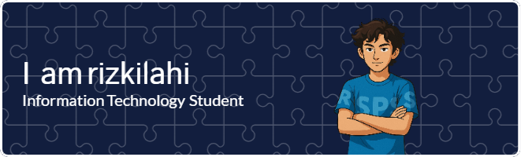

## Hello World! 🌏

  

<!--
**rizkilahi/rizkilahi** is a ✨ _special_ ✨ repository because its `README.md` (this file) appears on your GitHub profile.

Here are some ideas to get you started:

- 🔭 I’m currently working on ...
- 🌱 I’m currently learning ...
- 👯 I’m looking to collaborate on ...
- 🤔 I’m looking for help with ...
- 💬 Ask me about ...
- 📫 How to reach me: ...
- 😄 Pronouns: ...
- ⚡ Fun fact: ...
-->

---

### 👨‍🎓 About Me

- 🔭 I’m currently studying at [**Telkom University**](https://www.instagram.com/telkomuniversity/)
- 🌱 I’m currently learning **Machine Learning** and exploring more about **Cyber Security**
- 💬 Ask me about **web development**, **AI**, or anything related to **tech**
- 😄 Pronouns: he/him

---

### 🛠️ Skills

  
  
  
  
  

  
  
  
  
  

---

### ⚙️ Tools I Use

  
  
  
  

---

### 📊 GitHub Stats

  

---

### 🎮 Play Game

  <picture>
    <source media="(prefers-color-scheme: dark)" srcset="https://raw.githubusercontent.com/rizkilahi/rizkilahi/output/pacman-contribution-graph-dark.svg">
    <source media="(prefers-color-scheme: light)" srcset="https://raw.githubusercontent.com/rizkilahi/rizkilahi/output/pacman-contribution-graph.svg">
    
  </picture>

---

### 🐍 Snake Contribution Animation

  

---

### 📫 Let's Connect!

I'm always open to new ideas, collaborations, or just a friendly chat about tech and development.

---
