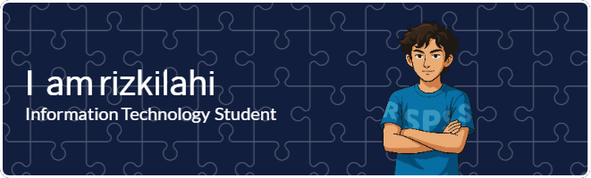

# Hello World! 🌏

<div align="center">
  
**"Code is like humor. When you have to explain it, it's bad." - Cory House**

</div>
  
</div>

<div align="center">
  
</div>

<div align="center">
  
  
</div>

<!--
**rizkilahi/rizkilahi** is a ✨ _special_ ✨ repository because its `README.md` (this file) appears on your GitHub profile.

Here are some ideas to get you started:

- 🔭 I’m currently working on ...
- 🌱 I’m currently learning ...
- 👯 I’m looking to collaborate on ...
- 🤔 I’m looking for help with ...
- 💬 Ask me about ...
- 📫 How to reach me: ...
- 😄 Pronouns: ...
- ⚡ Fun fact: ...
-->

---

### 👨‍🎓 About Me

<div align=## 👨‍🎓 About Me

<div align="center">

**🎓 Fresh Graduate in Information Technology | 💻 Full Stack Developer | 🤖 AI Enthusiast**

</div>

- 🎓 Fresh Graduate in **Information Technology** from [**Telkom University**](https://www.instagram.com/telkomuniversity/)
- 💼 Open to opportunities in **Full Stack Development**, **AI/ML Engineering**, and **Software Development**
- 🌱 Continuously learning **Machine Learning**, **Deep Learning**, and **Cyber Security**
- 💻 Experienced in building projects with **Laravel**, **React**, **Flutter**, and **Python**
- 🎯 Specializing in **Web Development**, **Mobile Apps**, and **AI/ML** applications
- 💬 Ask me about **Full Stack Development**, **AI/ML**, **Mobile Development**, or **Cyber Security**
- 🌟 Eager to contribute to innovative projects and collaborate with talented teams
- 🚀 Ready to bring fresh perspectives and strong technical skills to your organization
- 😄 Pronouns: **he/him**
- ⚡ Fun fact: I love exploring new technologies and building solutions that make a difference!

---

## 🛠️ Skills & Technologies

<div align="center">

### Frontend Development

<p>
  <a href="https://developer.mozilla.org/en-US/docs/Web/HTML" target="_blank"></a>
  <a href="https://developer.mozilla.org/en-US/docs/Web/CSS" target="_blank"></a>
  <a href="https://developer.mozilla.org/en-US/docs/Web/JavaScript" target="_blank"></a>
  <a href="https://react.dev/" target="_blank"></a>
  <a href="https://nextjs.org/" target="_blank"></a>
</p>

### Backend Development

<p>
  <a href="https://www.php.net/" target="_blank"></a>
  <a href="https://laravel.com/" target="_blank"></a>
  <a href="https://nodejs.org/" target="_blank"></a>
  <a href="https://expressjs.com/" target="_blank"></a>
  <a href="https://spring.io/" target="_blank"></a>
</p>

### Programming Languages

<p>
  <a href="https://www.python.org/" target="_blank"></a>
  <a href="https://isocpp.org/" target="_blank"></a>
  <a href="https://www.java.com/" target="_blank"></a>
  <a href="https://dart.dev/" target="_blank"></a>
  <a href="https://www.typescriptlang.org/" target="_blank"></a>
</p>

### Mobile Development

<p>
  <a href="https://flutter.dev/" target="_blank"></a>
  <a href="https://reactnative.dev/" target="_blank"></a>
</p>

### Databases & Cloud

<p>
  <a href="https://www.mysql.com/" target="_blank"></a>
  <a href="https://www.postgresql.org/" target="_blank"></a>
  <a href="https://www.mongodb.com/" target="_blank"></a>
  <a href="https://firebase.google.com/" target="_blank"></a>
  <a href="https://aws.amazon.com/" target="_blank"></a>
</p>

### DevOps & Version Control

<p>
  <a href="https://git-scm.com/" target="_blank"></a>
  <a href="https://github.com/" target="_blank"></a>
  <a href="https://www.docker.com/" target="_blank"></a>
  <a href="https://www.linux.org/" target="_blank"></a>
</p>

</div>

---

## 🚀 Current Projects & Achievements

### 💼 What I'm Working On

- 🔬 **AI Research Project**: Developing machine learning models for predictive analytics
- 📱 **Mobile App**: Building a cross-platform app with Flutter and Firebase
- 🌐 **Web Platform**: Creating a full-stack web application with Laravel and React
- 🛡️ **Cybersecurity Tool**: Developing security analysis tools for vulnerability assessment
- 📚 **Open Source**: Contributing to various open-source projects in the tech community

### 📝 Published Research

#### **R-CICIDS2017: Making the IDS Benchmark Realistic for Quantized Models in IoT Deployments**

- 📄 **Published in**: IEEE (2025)
- 👥 **Authors**: Muhamad Rizki Ilahi et al.
- 🔬 **Focus**: Network Security & IoT
- 📊 **Contribution**: Developed a novel realistic dataset and optimized Dynamically Quantized DNN model (14.9 KB) for lightweight Intrusion Detection Systems on IoT edge devices
- 🎯 **Achievement**: High accuracy with minimal computational complexity for resource-constrained IoT environments
- 🔗 **Status**: Published in IEEE Conference Proceedings

### 🏆 Awards & Scholarships

- 🏅 **BSI Scholarship Inspirasi Batch 3 Awardee** (November 2023 – November 2025)
  - Selected for academic excellence and leadership potential
  - Completed intensive development program covering Islamic Economics, personal development, and professional ethics
  - Led Community Service initiatives focused on social impact and local community empowerment

### 🎓 Academic & Professional Achievements

- 🎓 **Graduated**: Bachelor's Degree in Information Technology from Telkom University (2026)
  - Specialization: Network Security
- 🎯 **Research Publication**: Published paper in IEEE on IoT security and lightweight intrusion detection
- 💼 **Teaching Experience**: Coding instructor at Kalananti by Ruangguru (July 2025 – Present)
- 🔬 **Research Internship**: IT Research Intern at Forestry Laboratory, Telkom University
- 🤝 **Community Leadership**: Event organizer and mentor for various university organizations
- 💼 **Portfolio Projects**: Successfully delivered multiple full-stack applications and AI/ML projects

---

## 🎖️ Professional Certifications

<div align="center">

### Cloud Computing & AI

<table>
<tr>
<td align="center" width="50%">

**Microsoft Certified: Azure AI Fundamentals**


📅 September 2025 – September 2027

🆔 **Credential ID**: JGBE-4wBC

<a href="https://www.certiport.com/portal/Pages/PrintTranscriptInfo.aspx?action=Cert&id=455&cvid=pirFMy2BNzgQF68RdY4tqw==" target="_blank">
  
</a>

</td>
<td align="center" width="50%">

**AWS Academy Cloud Web Application Builder**


📅 June 2025 – June 2027

🆔 **Credential ID**: c5efcfba-6ec3-4407-8287-1be88465f351

<a href="https://www.credly.com/badges/c5efcfba-6ec3-4407-8287-1be88465f351/linked_in_profile" target="_blank">
  
</a>

</td>
</tr>
<tr>
<td align="center" width="50%">

**AWS Cloud Foundations**


📅 June 2025 – June 2027

🆔 **Credential ID**: d037e7bb-7240-41dd-a956-909cd309bba1

<a href="https://www.credly.com/badges/d037e7bb-7240-41dd-a956-909cd309bba1/linked_in_profile" target="_blank">
  
</a>

</td>
<td align="center" width="50%">

**Fundamental Cyber Security**


📅 June 2024 – June 2026

🆔 **Credential ID**: 75AF704A93-75AF60B904-75A384FC96

<a href="https://member.codingstudio.id/certificate/75AF704A93-75AF60B904-75A384FC96" target="_blank">
  
</a>

</td>
</tr>
<tr>
<td align="center" colspan="2">

**Microsoft Word with Copilot Training Certificate**


📅 January 2026 – January 2028

_Issued by Jobstreet_

</td>
</tr>
</table>

### 🌟 Certification Highlights

- ☁️ **Cloud Computing**: Expertise in AWS and Microsoft Azure platforms
- 🤖 **Artificial Intelligence**: Certified in Azure AI Fundamentals
- 🔒 **Cybersecurity**: Foundation certification in cybersecurity principles
- 💼 **Professional Tools**: Microsoft productivity tools with AI integration

</div>

---

## ⚙️ Tools & Development Environment

<div align="center">

### 💻 Development Tools

<p>
  <a href="https://code.visualstudio.com/" target="_blank">
    
  </a>
  <a href="https://www.jetbrains.com/phpstorm/" target="_blank">
    
  </a>
  <a href="https://www.jetbrains.com/idea/" target="_blank">
    
  </a>
</p>

### 🤖 AI & Learning Tools

<p>
  <a href="https://openai.com/chatgpt" target="_blank">
    
  </a>
  <a href="https://colab.research.google.com/" target="_blank">
    
  </a>
  <a href="https://jupyter.org/" target="_blank">
    
  </a>
</p>

### 📚 Learning Resources

<p>
  <a href="https://www.w3schools.com/" target="_blank">
    
  </a>
  <a href="https://stackoverflow.com/" target="_blank">
    
  </a>
  <a href="https://github.com/" target="_blank">
    
  </a>
</p>

</div>

---

## 📊 GitHub Analytics

<div align="center">

### 📈 GitHub Statistics

<p>
  
  
</p>

### 🔥 Streak Stats

<p>
  
</p>

### 📊 Activity Graph

<p>
  
</p>

### 🏆 GitHub Trophies

<p>
  
</p>

</div>

---

### 🎮 Play Game

<div align="center">
  <picture>
    <source media="(prefers-color-scheme: dark)" srcset="https://raw.githubusercontent.com/rizkilahi/rizkilahi/output/pacman-contribution-graph-dark.svg">
    <source media="(prefers-color-scheme: light)" srcset="https://raw.githubusercontent.com/rizkilahi/rizkilahi/output/pacman-contribution-graph.svg">
    
  </picture>
</div>

---

### 🐍 Snake Contribution Animation

<div align="center">
  
</div>

---

## 📫 Let's Connect

<div align="center">

**I'm always open to new ideas, collaborations, or just a friendly chat about tech and development!**

### 🌐 Find Me Online

<p>
<a href="https://www.linkedin.com/in/muhamad-rizki-ilahi-337a55208/" target="_blank">
  
</a>
<a href="https://www.instagram.com/rizkilahi_/" target="_blank">
  
</a>
<a href="https://discord.com/users/puntenmamang1805" target="_blank">
  
</a>
</p>

<p>
<a href="https://www.youtube.com/@sambilmain21" target="_blank">
  
</a>
<a href="https://t.me/rizkilahi" target="_blank">
  
</a>
<a href="mailto:muhamadrizkiilahi03@gmail.com" target="_blank">
  
</a>
</p>

### 💬 Quick Contact

```
📧 Email: muhamadrizkiilahi03@gmail.com
💼 LinkedIn: Muhamad Rizki Ilahi
🐦 Response Time: Usually within 24 hours
```

</div>

---

<div align="center">

### 🎯 "Building the future, one line of code at a time"

<p>
  
</p>

**Thank you for visiting my profile! 🚀**

💼 **Currently seeking opportunities as a Full Stack Developer, Software Engineer, or AI/ML Engineer**

_Last updated: February 2026_

</div>
